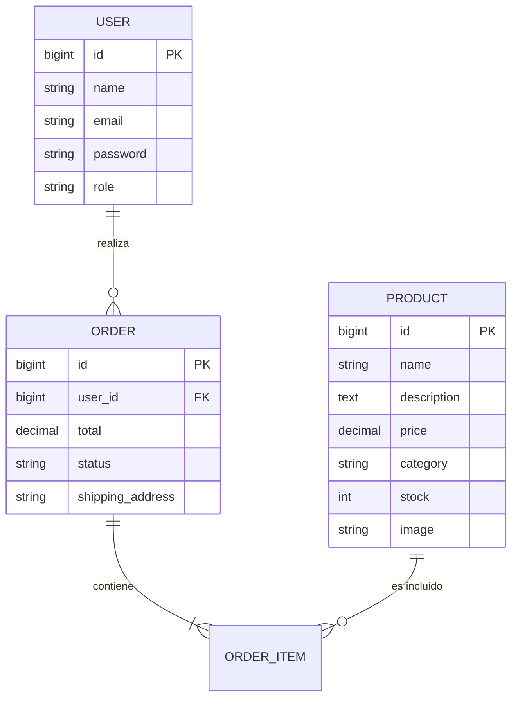

# FishPot: Plataforma Integral para la Gestión y Consulta de Pesca Recreativa

**Autor:** [Nombre del Alumno]  
**Tutor:** [Nombre del Tutor]  
**Fecha:** Abril 2026  
**Proyecto de Fin de Grado (TFG)**  
**Grado en Ingeniería Informática**

---

## 1. Resumen
FishPot es una aplicación web moderna diseñada para la comunidad de pesca recreativa, con un enfoque inicial en la región de Lanzarote. La plataforma combina un comercio electrónico especializado en artículos de pesca, un visor de mareas en tiempo real y una enciclopedia de especies locales. Desarrollada con tecnologías de vanguardia como Laravel 12 para el backend y Vue.js 3 para el frontend, FishPot ofrece una experiencia de usuario fluida, segura y adaptada a dispositivos móviles.

## 2. Introducción
### 2.1 Contexto y Justificación
La pesca recreativa es una actividad con gran arraigo en las Islas Canarias, especialmente en Lanzarote. Sin embargo, los pescadores a menudo tienen que recurrir a múltiples plataformas para consultar el estado del mar, identificar capturas o adquirir material. FishPot nace de la necesidad de centralizar estas herramientas en una única interfaz intuitiva.

### 2.2 Objetivos
- **General:** Desarrollar una plataforma integral que cubra las necesidades informativas y comerciales del pescador recreativo.
- **Específicos:**
    - Implementar un sistema de e-commerce robusto.
    - Proporcionar datos precisos sobre mareas.
    - Crear un catálogo visual de especies marinas locales.
    - Ofrecer un panel de administración para la gestión de inventario y pedidos.

---

## 3. Análisis de Requisitos
### 3.1 Requisitos Funcionales
1.  **Gestión de Usuarios:** Registro, inicio de sesión y gestión de perfil (Laravel Breeze).
2.  **Catálogo de Productos:** Visualización de artículos con filtros por categoría.
3.  **Carrito de Compras:** Gestión persistente de artículos (Pinia).
4.  **Gestión de Pedidos:** Proceso de checkout, generación de facturas en PDF y seguimiento de estado.
5.  **Consulta de Mareas:** Información actualizada para la planificación de jornadas de pesca.
6.  **Guía de Especies:** Información visual y descriptiva de las especies locales.
7.  **Panel de Administración:**
    - Control de stock y productos (CRUD).
    - Gestión de usuarios y roles (Admin/User).
    - Procesamiento de pedidos (Aceptar/Enviar/Cancelar).

### 3.2 Requisitos No Funcionales
- **Rendimiento:** Carga inicial inferior a 1.5s. Capacidad para 100 usuarios concurrentes.
- **Seguridad:** Cifrado BCrypt, protección CSRF y middleware de autenticación/autorización.
- **Usabilidad:** Diseño 100% responsive mediante TailwindCSS. Navegación simplificada (máximo 3 clics para encontrar un producto).
- **Mantenibilidad:** Arquitectura desacoplada (API + SPA) y código siguiendo estándares PSR-12.

---

## 4. Diseño del Sistema
### 4.1 Arquitectura de Software
La aplicación sigue una arquitectura **SPA (Single Page Application)**:
- **Backend:** Laravel 12 actuando como una RESTful API. Utiliza Eloquent ORM para la interacción con la base de datos.
- **Frontend:** Vue.js 3 con Composition API, utilizando Vue Router para la navegación y Pinia para la gestión del estado global (carrito de compras y autenticación).
- **Comunicación:** Axios para peticiones asíncronas entre el cliente y el servidor.

### 4.2 Modelo de Datos (Entidad-Relación)
El sistema utiliza una base de datos MySQL con las siguientes entidades principales:
- **Users:** Almacena credenciales y roles.
- **Products:** Información de stock, precio, descripción e imágenes.
- **Orders:** Cabecera de los pedidos realizados.
- **OrderItems:** Detalle de productos dentro de cada pedido.
- **Clients:** Información extendida para envíos y facturación.



### 4.3 Tecnologías Utilizadas
- **Lenguajes:** PHP 8.2+, JavaScript (ES6+), HTML5, CSS3.
- **Frameworks:** Laravel 12, Vue.js 3.
- **Estilos:** TailwindCSS.
- **Infraestructura:** Docker, Nginx, MySQL.
- **Herramientas:** Vite (empaquetador), DomPDF (generación de facturas), Mailpit (pruebas de correo).

---

## 5. Implementación
### 5.1 Estructura del Proyecto
```text
FishPot/
├── app/                        # Capa de Aplicación (Lógica de Negocio)
│   ├── Http/Controllers/       # Controladores (Product, Order, Tide, etc.)
│   ├── Models/                 # Modelos de Eloquent
│   └── Mail/                   # Sistema de envío de facturas
├── database/                   # Migraciones y Seeders
├── resources/js/               # Frontend (Vue 3)
│   ├── components/             # Componentes reutilizables (Toast, etc.)
│   ├── views/                  # Páginas de la SPA (Home, Shop, Admin, etc.)
│   └── stores/                 # Gestión de estado con Pinia
└── routes/                     # Definición de rutas API y Web
```

### 5.2 Lógica Destacada
- **Consulta de Mareas (WorldTides API):** El sistema se conecta a la API de `WorldTides.info` (versión v3) para obtener datos precisos de pleamar y bajamar en las coordenadas de Lanzarote (29.035, -13.633). Los datos se formatean en el servidor para ser consumidos por el componente de Vue, incluyendo un sistema de *fallback* que genera datos simulados basados en ciclos lunares si la API externa no está disponible.
- **Proceso de Compra y Facturación:** Al realizar un pedido, se valida el stock, se crea el registro en la base de datos y se dispara un evento para enviar la factura por correo electrónico. Se utiliza la librería `barryvdh/laravel-dompdf` para generar un documento PDF profesional que se adjunta automáticamente al correo del cliente.
- **Seguridad de Admin:** El acceso a las rutas `/admin` está protegido por un middleware personalizado (`AdminMiddleware`) que verifica de forma estricta que el campo `role` del usuario autenticado sea igual a 'admin', redirigiendo a los usuarios no autorizados.

---

## 6. Pruebas y Validación
Se han implementado pruebas automatizadas para garantizar la estabilidad del sistema:
- **Feature Tests:** Pruebas de integración para los flujos de autenticación y actualización de perfiles.
- **Unit Tests:** Pruebas de lógica aislada.
- **Validación Manual:** Pruebas de compatibilidad en dispositivos Android/iOS y navegadores Chrome/Firefox/Safari.

---

## 7. Manual de Usuario
### 7.1 Para el Cliente
1.  **Navegación:** Acceda a la sección "Tienda" para explorar productos.
2.  **Compra:** Añada productos al carrito y proceda al pago desde la vista del carrito.
3.  **Mareas:** Consulte la sección "Mareas" para ver el estado del mar en Lanzarote.
4.  **Perfil:** Desde su área personal, puede ver su historial de pedidos.

### 7.2 Para el Administrador
1.  **Acceso:** Inicie sesión con una cuenta con rol administrativo.
2.  **Inventario:** Desde el panel de control, puede añadir, editar o eliminar productos.
3.  **Pedidos:** Visualice los pedidos entrantes y actualice su estado a "Aceptado" o "Enviado".

---

## 8. Conclusiones y Trabajo Futuro
### 8.1 Conclusiones
El desarrollo de FishPot ha permitido integrar con éxito un e-commerce con servicios de información en tiempo real. Se ha priorizado la experiencia de usuario y la robustez del backend, cumpliendo con todos los objetivos iniciales del TFG.

### 8.2 Trabajo Futuro
- Implementar una pasarela de pago real (Stripe/PayPal).
- Añadir un sistema de pronóstico meteorológico avanzado mediante API de MeteoBlue.
- Desarrollar una App móvil nativa utilizando los mismos endpoints de la API actual.
- Implementar un foro o red social pequeña para que los pescadores compartan sus capturas.
